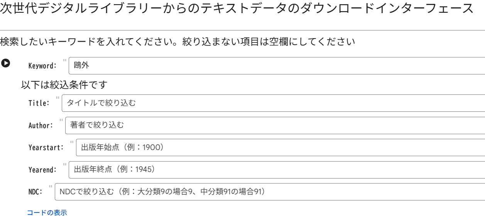
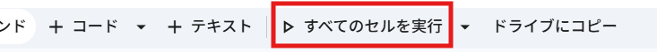
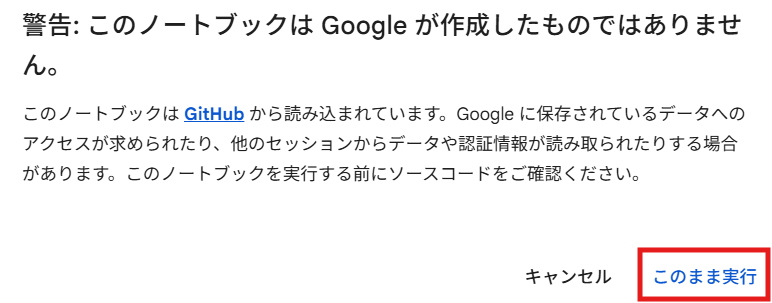
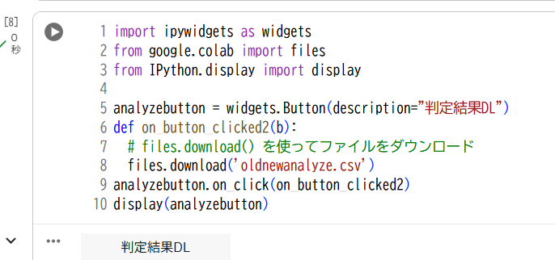

# NextDLAnalyzer
次世代デジタルライブラリーからのテキストデータのダウンロードと分析ツール

TF-IDF特徴量とLightGBMによる、テキストデータの旧かな/新かな自動判定機能を有した、ダウンローダです。

## 使い方
Open in Colabボタンを押すとGoogle Colabotatoryノートブックが開く。

次のUIが表示されるので、検索・取得したい内容を入れる。

上部に表示されるバーから、「すべてのセルを実行」ボタンを押す。

次の警告が出るので、「このまま実行」ボタンを押す。

しばらく待つと上部から順番にコードが実行される。

次の「テキストDL」ボタンを押すと、取得したテキストデータをダウンロードできる。

次の「判定結果DL」ボタンを押すと、機械学習モデルによる新かな旧かな判定結果を含めた表をダウンロードできる。

